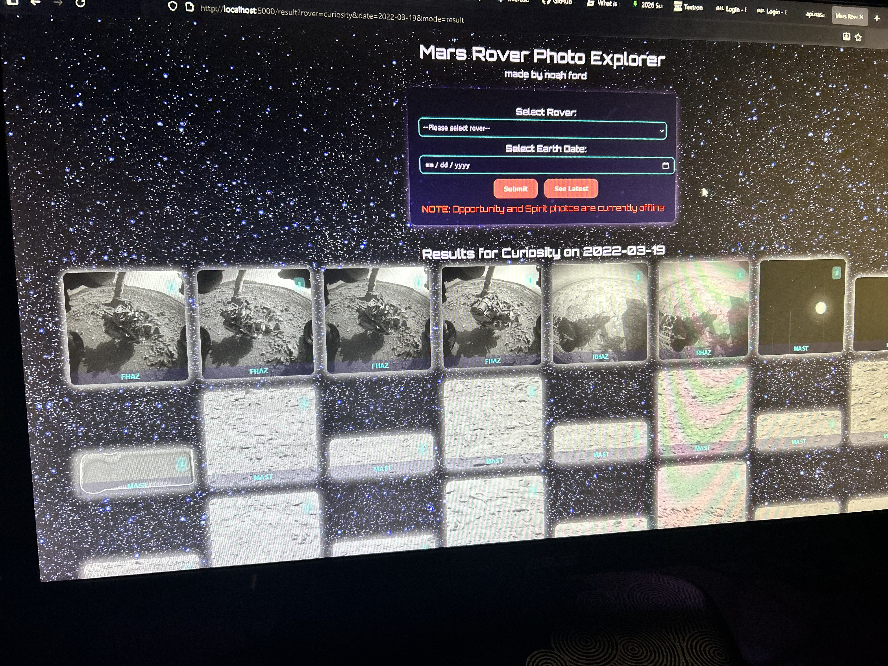

# Mars-Rover-Photo-Explorer
A now deprecated webapp that uses a (now retired) NASA API that allows the user to query Mars Rover photos by Rover name and Date.

Coded using a Flask backend alongside an HTML frontend.

